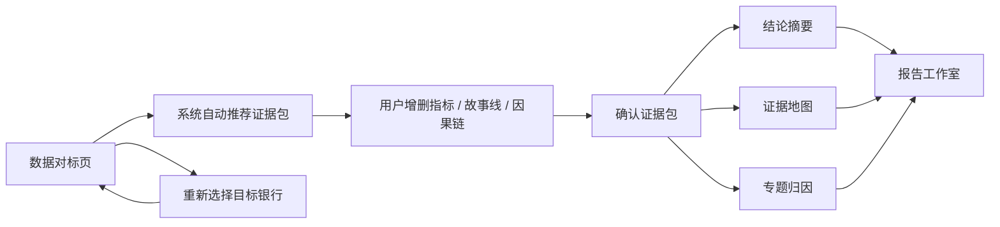

# 证据包驱动的分析页面设计说明

日期：2026-06-19  
适用范围：数据对标页、结论摘要、证据地图、专题归因、报告工作室入口  
设计结论：采用“系统推荐 + 用户可增删”的混合型证据包工作流。

## 1. 背景与问题

当前数据对标页已经可以选择目标银行、对标组、分析年份，并且可以形成指标、故事线和因果链。但后续“结论摘要、证据地图、专题归因”仍主要依赖通用的 `targetRecord()` 和 `peerRecords()` 模板逻辑生成，导致两类问题：

1. 用户选定目标银行并完成对标后，缺少清晰的“重新选择目标银行”入口，容易被锁在当前分析对象里。
2. 后续页面没有严格消费数据对标页生成的证据包，语言容易停留在“值得关注、持续跟踪、结构承压”等表面表达，缺少指标值、同业差距、证据强度和因果链。

本轮目标不是增加更多页面，而是把现有页面改成“证据包驱动”：数据对标页生成并确认一个证据包，结论摘要、证据地图、专题归因都从同一个证据包模型生成。

## 2. 设计原则

### 2.1 入口原则

默认入口仍应是数据对标页，而不是参数页或报告页。参数页只作为旧链接兼容，不作为主流程必经页面。

数据对标页顶部需要始终提供“重新选择目标银行”入口。用户可以在不回到复杂首页的情况下重新选择目标银行、分析年份和对标组。

### 2.2 证据原则

每条进入结论摘要、证据地图和专题归因的判断，都必须能回溯到证据包中的一条或多条证据。

每条证据至少包含：

- 指标名称
- 目标银行数值
- 对标组数值
- 差距
- 方向
- 证据强度
- 数据来源或生成口径
- 对应的问题或因果链

没有证据支撑的表达不能进入主结论，只能作为弱提示或复核建议。

### 2.3 用户控制原则

系统可以自动推荐证据包，但不能直接把推荐问题变成正式结论。用户需要在数据对标页看到“推荐问题”和“已选入报告”之间的区别，并可以增删。

后续页面只读取用户确认后的 `selectedIssues`，不读取被排除的问题。

## 3. 总体工作流



用户路径：

1. 进入数据对标页。
2. 选择目标银行、分析年份和对标组。
3. 系统自动推荐 3-5 个核心经营问题。
4. 用户在证据包托盘中增删指标、故事线和因果链。
5. 用户点击“确认证据包”。
6. 系统统一重生成结论摘要、证据地图和专题归因。
7. 用户进入报告工作室时，报告章节继续使用同一个证据包。

## 4. UX 设计

### 4.1 重新选择目标银行

数据对标页顶部固定一条上下文栏，显示：

- 当前目标银行
- 分析年份
- 对标组类型
- 对标机构数量
- “重新选择”按钮

点击“重新选择”后打开右侧抽屉或顶部弹层，提供三个动作：

1. **保留证据包草稿并切换目标银行**  
   适用于用户只是想比较另一个目标银行，但希望保留当前证据包作为参考。

2. **清空证据包并重新选择**  
   适用于重新开始一轮分析。

3. **复制为新分析**  
   适用于保留原分析结果，并在新对象上复用同一套对标逻辑。

默认推荐动作是“清空证据包并重新选择”，避免不同银行的证据混用。

### 4.2 证据包托盘

数据对标页右侧增加证据包托盘，托盘分为两块：

- **系统推荐问题**：系统根据指标差距、趋势变化、同业位置和因果链自动推荐。
- **已选入报告**：用户确认要进入结论摘要、证据地图和专题归因的问题。

每个推荐问题卡片显示：

- 问题标题
- 主指标
- 差距
- 证据强度
- 因果链摘要
- 加入 / 移除按钮

托盘底部显示：

- 已选问题数
- 已选证据数
- 已选因果链数
- “确认证据包”按钮

确认证据包后，系统生成一个版本号，例如 `evidencePack.version = 20260619-1430`，后续页面显示该版本号，方便用户知道当前页面来自哪一版证据包。

### 4.3 三页统一重生成

证据包确认后统一触发：

- 结论摘要重生成
- 证据地图重生成
- 专题归因重生成
- 报告工作室证据摘要刷新

页面顶部都需要显示证据包状态：

- 目标银行
- 分析年份
- 对标组
- 证据包版本
- 生成时间
- 已选问题数量

如果证据包为空或已过期，页面不能生成泛化内容，而应提示用户回到数据对标页确认证据包。

## 5. 证据包数据模型

证据包建议结构如下：

```js
{
  version: "20260619-1430",
  status: "draft" | "confirmed" | "stale",
  targetBank: {
    id: "CN033",
    name: "苏州农商行",
    type: "农村商业银行",
    region: "江苏"
  },
  year: 2025,
  peerGroup: {
    label: "全国同类 + 本地同类 + 自选对标",
    banks: ["常熟农商行", "瑞丰农商行", "上海农商行"],
    peerBasis: ["全国同类", "本地同类", "自选"]
  },
  recommendedIssues: [
    {
      issueId: "profitability_pressure",
      title: "盈利能力承压",
      priority: 1,
      confidence: "高",
      primaryMetric: "ROE",
      conclusion: "ROE 低于同业，主要受 NIM 与成本收入比拖累",
      evidence: [
        {
          evidenceId: "ev_roe_gap",
          metric: "ROE",
          targetValue: "8.2%",
          peerValue: "10.4%",
          gap: "-2.2pct",
          direction: "低于同业",
          strength: "强",
          source: "2025 年末数据对标"
        }
      ],
      causalChain: [
        "ROE 低于同业",
        "因为 NIM 低于同业",
        "因为负债端定期化率高、存款成本率偏高"
      ],
      reportUse: ["结论摘要", "证据地图", "专题归因"]
    }
  ],
  selectedIssues: ["profitability_pressure"],
  excludedIssues: [],
  narrativeGuardrails: {
    mustCiteEvidence: true,
    avoidGenericLanguage: true,
    maxPrimaryIssues: 3
  }
}
```

## 6. 页面消费规则

### 6.1 结论摘要

结论摘要只回答三个问题：

1. 当前最重要的 1-3 个经营问题是什么？
2. 每个判断的证据是什么？
3. 管理层下一步应该先看哪里？

页面结构：

- 顶部总判断
- 三张核心问题卡
- 每张卡显示：指标差距、证据强度、因果链第一层、建议动作
- 页面底部显示“本页使用的证据编号”

禁止出现没有证据编号的主结论。

### 6.2 证据地图

证据地图按照证据强度组织，不按原来的通用异动列表组织。

页面结构：

- 左侧：问题列表
- 中间：证据表格
- 右侧：证明链

证据分级：

- **强证据**：目标值与同业差距明显，趋势方向一致，口径完整。
- **中证据**：差距明显，但趋势或口径存在复核点。
- **弱证据**：只能作为提示，不进入主结论。

每条证据必须显示支持哪个结论，不能只显示指标本身。

### 6.3 专题归因

专题归因从 `causalChain` 展开。

每个专题至少包括四层：

1. 结果指标：例如 ROE、PB、不良率。
2. 直接驱动：例如 NIM、成本收入比、拨备覆盖率。
3. 结构原因：例如定期化率、存款成本率、贷款结构、区域风险暴露。
4. 行动抓手：例如负债结构优化、风险定价、对公授信收缩、零售客群调整。

专题页面不再按固定模板写“盈利、息差、风险、资本”，而是按证据包中的 `selectedIssues` 排序。

## 7. 状态与错误处理

### 7.1 证据包状态

- `draft`：系统已推荐，但用户还没有确认。
- `confirmed`：用户已确认，后续页面可以生成。
- `stale`：目标银行、对标组或年份发生变化，旧证据包不再可信。

### 7.2 重新选择后的处理

用户重新选择目标银行时：

- 默认把旧证据包标记为 `stale`。
- 如果用户选择“保留草稿”，旧证据包只作为参考，不进入后续页面。
- 如果用户选择“清空并重选”，删除旧草稿并重新推荐。
- 如果用户选择“复制为新分析”，创建新的证据包版本。

### 7.3 空状态

如果用户直接进入结论摘要、证据地图或专题归因，但没有已确认证据包，页面显示：

“请先在数据对标页确认证据包。后续页面将基于已确认的问题、证据和因果链生成。”

页面提供按钮“返回数据对标”。

## 8. 测试要求

需要新增或更新以下契约测试：

1. 默认入口为数据对标页。
2. 数据对标页存在“重新选择目标银行”入口。
3. 重新选择目标银行会将已确认证据包标记为 `stale` 或清空。
4. 证据包确认后写入 `benchmarkiq.evidencePack`。
5. 结论摘要只消费 `selectedIssues`。
6. 证据地图必须显示证据强度和证明链。
7. 专题归因必须显示多层因果链。
8. 当证据包为空或过期时，后续页面不能生成泛化内容。

## 9. 分阶段实施建议

### 第一阶段：流程与状态

- 增加“重新选择目标银行”入口。
- 增加证据包状态：`draft / confirmed / stale`。
- 重新选择时处理旧证据包。
- 确认证据包后统一触发后续页面刷新。

### 第二阶段：证据包模型

- 将系统推荐问题升级为结构化 `recommendedIssues`。
- 将用户选择结果保存为 `selectedIssues`。
- 每条问题绑定证据、差距、强度和因果链。

### 第三阶段：页面重生成

- 重写结论摘要模型。
- 重写证据地图模型。
- 重写专题归因模型。
- 报告工作室读取同一证据包摘要。

### 第四阶段：语言质量

- 增加“无证据不下结论”校验。
- 增加“避免泛化语言”校验。
- 每个段落至少引用一个证据编号或因果链节点。

## 10. 非目标

本设计不处理以下内容：

- 不重新设计完整报告工作室。
- 不新增外部大模型接口。
- 不改变数据对标页已有指标计算口径。
- 不把参数页重新作为主入口。

## 11. 自审结论

本设计无未决项。核心范围集中在“重新选择目标银行”和“证据包驱动三页生成”两个问题上。实施时应避免扩大到完整报告模板重构，先保证证据包成为结论摘要、证据地图和专题归因的唯一输入。
